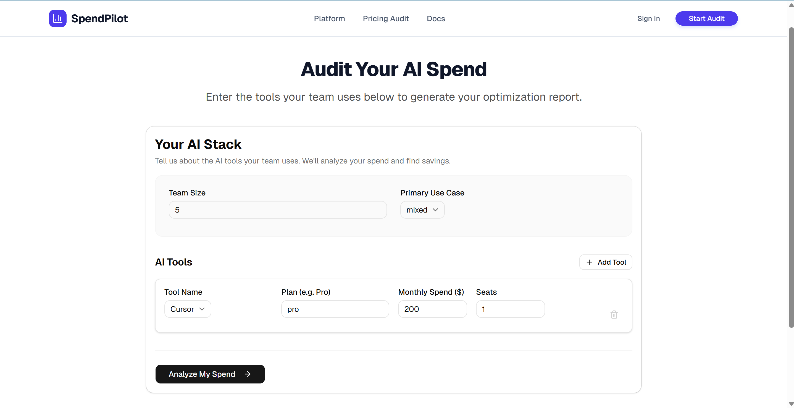
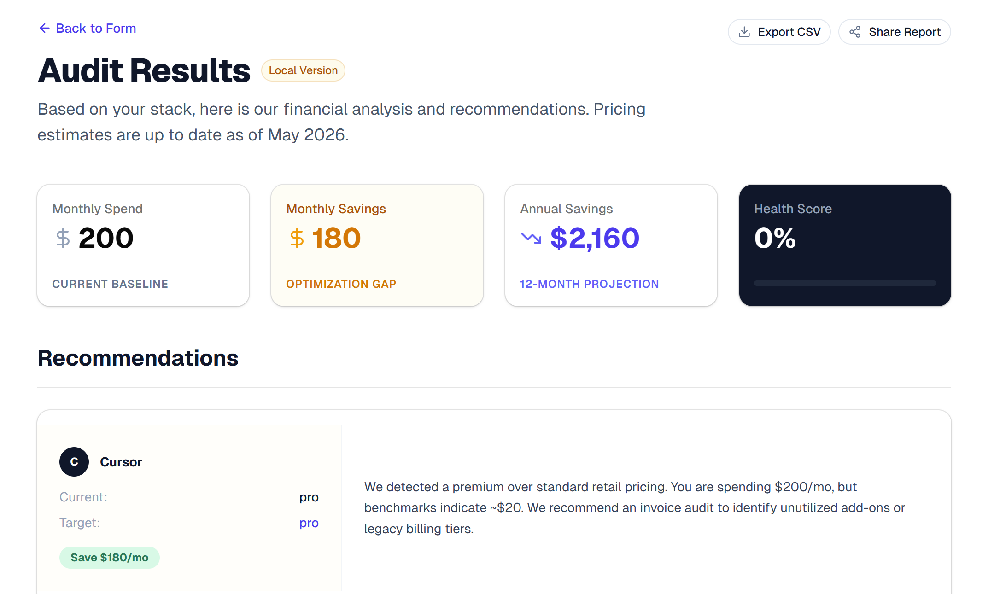
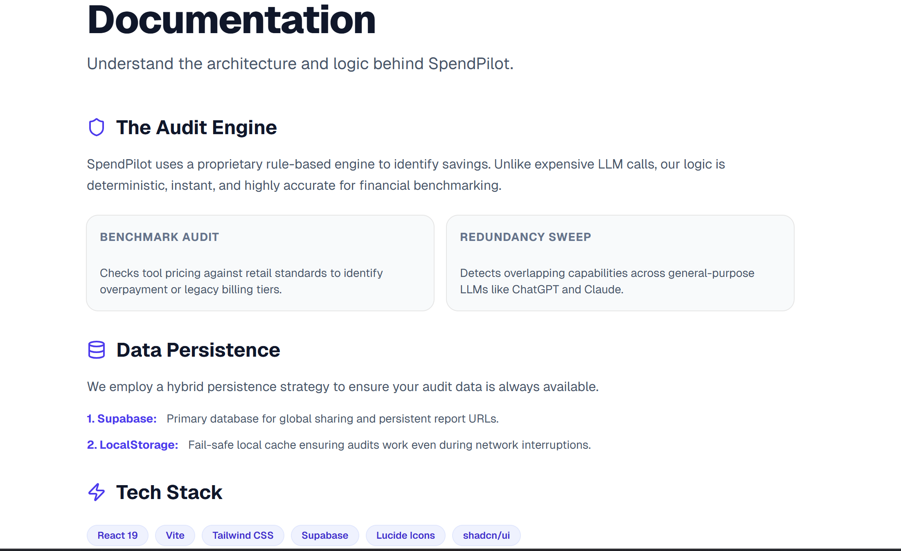

# 🚀 SpendPilot: AI Spend Audit SaaS MVP

**SpendPilot** is a startup-style AI Spend Audit platform built for the Credex Web Development Internship assignment. It helps organizations identify underutilized AI subscriptions, detect overlapping tools, and optimize monthly AI spending through an interactive audit workflow.


# 📖 The Business Case

Modern startups are rapidly adopting AI tools like ChatGPT, Claude, Cursor, Copilot, and Gemini. Over time, companies often accumulate overlapping subscriptions, unused seats, and inflated enterprise plans.

**SpendPilot** simulates a lightweight financial audit platform that helps teams:

- Detect overspending
- Identify redundant AI tools
- Estimate monthly and annual savings
- Generate shareable optimization reports

The project focuses on delivering a polished MVP experience within a strict 7-day execution timeline.

---

# 🌟 Core Features

- ✅ Dynamic AI audit engine with realistic savings logic
- ✅ Interactive multi-tool audit form
- ✅ React Hook Form + Zod validation
- ✅ Dynamic report generation with unique URLs
- ✅ Supabase-powered report persistence
- ✅ localStorage fallback caching
- ✅ Financial KPI dashboard
- ✅ Annual savings projections
- ✅ Health score system
- ✅ CSV export support
- ✅ Mobile responsive SaaS UI
- ✅ Shareable report links
- ✅ Print-friendly report layout
- ✅ Loading states and polished UX flows

---

# 📸 Screenshots

## Landing Page


## Audit Form


## Audit Report


## Documentation Page



---

# 🛠️ Tech Stack

## Frontend
- React 18
- Vite
- React Router DOM

## UI & Styling
- Tailwind CSS
- shadcn/ui
- Radix UI
- Lucide React

## Forms & Validation
- React Hook Form
- Zod

## Backend / Persistence
- Supabase
- localStorage fallback

## Deployment
- Vercel

---

# 🏗️ Architecture Decisions

## 1. Simulation-First MVP Strategy

Instead of relying on expensive AI APIs or complex backend infrastructure, SpendPilot uses a deterministic frontend audit engine powered by benchmark pricing data.

This approach allowed:
- Faster iteration
- Better stability
- Realistic recommendations
- Predictable outputs
- Recruiter-friendly demo reliability

The focus was product execution and UX quality rather than unnecessary infrastructure complexity.

---

## 2. Hybrid Persistence Strategy

SpendPilot uses a hybrid persistence architecture:

- **Supabase** stores generated audit reports and enables shareable report URLs.
- **localStorage** acts as a fallback cache to improve resilience during refreshes and temporary connection interruptions.

This balances SaaS realism with MVP simplicity.

---

## 3. Dynamic Report Architecture

Each audit generates a unique report route:

```bash
/report/:id
```

This creates a real SaaS-like experience where reports can be revisited, refreshed, exported, and shared.

---

## 4. Product-Focused Engineering

The project intentionally prioritizes:
- UX polish
- responsiveness
- loading states
- clean architecture
- realistic financial logic

over unnecessary enterprise-level abstractions.

The goal was to build a believable startup MVP within a constrained timeline.

---

# ⚙️ Local Setup

## 1. Clone Repository

```bash
git clone https://github.com/Anish9686/SpendPilot.git
```

---

## 2. Install Dependencies

```bash
npm install
```

---

## 3. Configure Environment Variables

Create a `.env` file:

```env
VITE_SUPABASE_URL=your_supabase_url
VITE_SUPABASE_ANON_KEY=your_supabase_anon_key
```

---

## 4. Start Development Server

```bash
npm run dev
```

---

# 🧪 Production Validation

The project was tested for:

- ✅ Responsive layouts
- ✅ Dynamic route refresh handling
- ✅ Empty states
- ✅ Share functionality
- ✅ CSV export
- ✅ localStorage persistence
- ✅ Supabase persistence
- ✅ Production build generation

---

# 📁 Project Structure

```bash
src/
 ├── components/
 ├── layouts/
 ├── lib/
 │    ├── auditEngine.js
 │    ├── pricing.js
 │    ├── schema.js
 │    └── supabase.js
 ├── pages/
 │    ├── LandingPage.jsx
 │    ├── AuditPage.jsx
 │    ├── AuditReportPage.jsx
 │    └── DocsPage.jsx
 ├── App.jsx
 └── main.jsx
```

---

# 📚 Additional Documentation

The repository also includes:

- `DEVLOG.md`
  → Daily execution log across the 7-day sprint

- `ARCHITECTURE.md`
  → Explanation of system design and audit engine decisions

- `REFLECTION.md`
  → Engineering tradeoffs and lessons learned

---

# 🚀 Future Improvements

- [ ] Authentication & team accounts
- [ ] Automated invoice ingestion
- [ ] AI-powered recommendation tuning
- [ ] Organization dashboards
- [ ] Email report delivery
- [ ] Real billing analytics integrations

---

# 🌐 Live Demo

```bash
https://spend-pilot-eight.vercel.app
```

---

# 👨‍💻 Author

**Anish Kumar**

Built as part of the **Credex Web Development Internship Assignment**.

---

# ❤️ Final Note

SpendPilot was designed as a fast-moving, startup-style MVP focused on product thinking, execution quality, and realistic SaaS workflows rather than overengineered infrastructure.

The project emphasizes:
- rapid iteration
- practical architecture
- clean UX
- believable business logic
- recruiter-friendly engineering decisions
